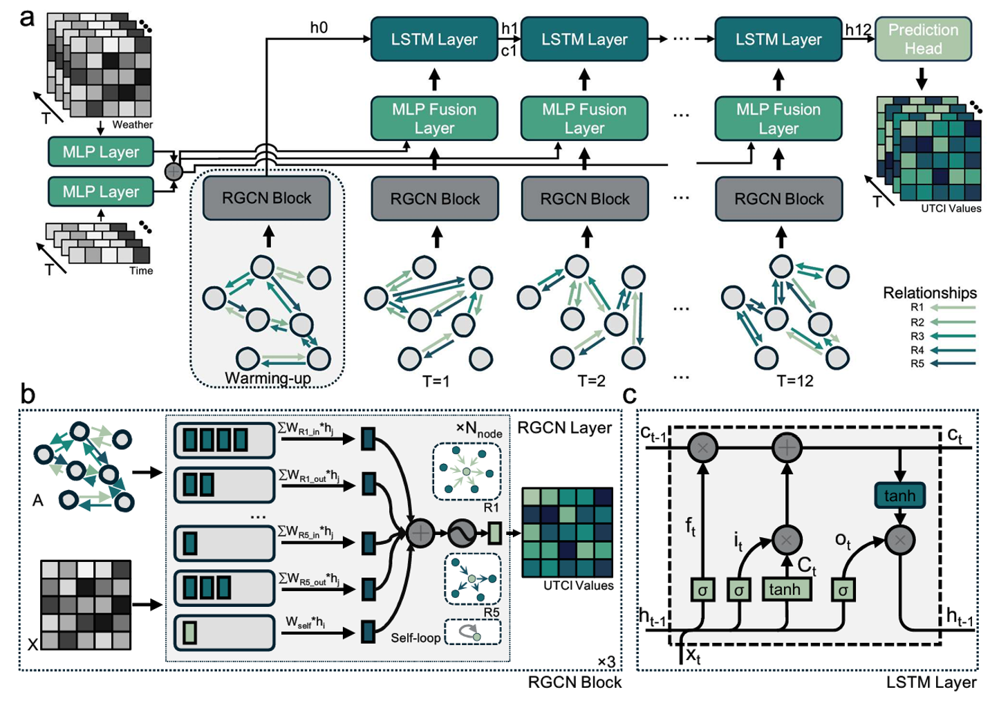

# **UrbanGraph: Physics-Informed Spatio-Temporal Dynamic Heterogeneous Graphs for Urban Microclimate Prediction**

This repository contains the official PyTorch implementation and the **UMC4/12 Dataset** for the paper: **\[UrbanGraph: Physics-Informed Spatio-Temporal Dynamic Heterogeneous Graphs for Urban Microclimate Prediction\]**.

Our work introduces UrbanGraph, a computationally efficient spatio-temporal forecasting architecture, coupled with a novel physics-informed dynamic graph representation for highly accurate urban microclimate prediction.

**Introduction** *With rapid urbanization, predicting urban microclimates has become critical, as it affects building energy demand and public health risks. However, existing generative and homogeneous graph approaches fall short in capturing physical consistency, spatial dependencies, and temporal variability. To address this, we introduce UrbanGraph, a physics-informed framework integrating heterogeneous and dynamic spatio-temporal graphs. It encodes key physical processes—vegetation evapotranspiration, shading, and convective diffusion—while modeling complex spatial dependencies among diverse urban entities and their temporal evolution. We evaluate UrbanGraph on UMC4/12, a physics-based simulation dataset covering diverse urban configurations and climates. Results show that UrbanGraph improves R² by up to 10.8\% and reduces FLOPs by 17.0\% over all baselines, with heterogeneous and dynamic graphs contributing 3.5\% and 7.1\% gains. Our dataset provides the first high-resolution benchmark for spatio-temporal microclimate modeling, and our method extends to broader urban heterogeneous dynamic computing tasks. *

## **Key Features**

* **Physics-Informed Dynamic Graphs**: Explicitly encodes time-varying physical processes like shadowing, vegetation activity, and local wind fields into the graph topology on an hourly basis.  
* **UrbanGraph**: A novel and efficient spatio-temporal network (our main contribution) composed of Feature Encoders, a Spatial Graph Encoder (RGCN), a Spatio-Temporal Evolution Module (LSTM), and a Prediction Head.  
* **UMC4/12 Dataset**: A new high-fidelity benchmark dataset with 4-meter resolution data for 396 urban plots in Singapore, covering 12 hours of 6 key microclimate variables, generated via ENVI-met simulations.  
* **Reproducible Baselines**: Includes implementations for a wide range of baseline models from our paper for fair and comprehensive comparison.

## **Repository Structure**

UrbanGraph
├── README.md  
├── LICENSE  
├── requirements.txt  
├── data/                   
│   ├── Input/  
│   ├── Output/  
│   └── SGP\_...\_EPW.csv  
├── src/                   
│   ├── \_\_init\_\_.py  
│   ├── data\_processing.py  
│   ├── graph\_construction.py  
│   ├── models.py  
│   ├── engine.py  
│   └── utils.py  
├── scripts/                
│   ├── build\_graph\_data.py  
│   └── train.py  
└── checkpoints/           
    └── TDRGCN\_seed43/  
        ├── best\_tdrgcn\_model\_seed43.pth  
        ├── node\_feature\_scaler\_seed43.pth  
        ├── target\_scaler\_seed43.pth  
        └── training\_report\_seed43.json

## **Setup & Installation**

1. **Clone the repository:**  
   git clone \[https://github.com/wlxin-nus/UrbanGraph.git]
   cd UrbanGraph-main

2. Create a Python environment and install dependencies:  
   We recommend using Conda for environment management.  
   conda create \-n tdrgcn python=3.9  
   conda activate tdrgcn  
   pip install \-r requirements.txt

## **Usage**

The pipeline consists of two main steps: data preparation and model training/evaluation.

1\. Data Preparation:  
First, run the script to process the raw .npy data and construct the dynamic graph sequences. The processed data will be saved as a .pkl file.  
python scripts/build\_graph\_data.py \\  
    \--input\_dir ./data/Input \\  
    \--output\_dir ./data/Output \\  
    \--csv\_path ./data/SGP\_SINGAPORE-CHANGI-IAP\_486980S\_23EPW.csv \\  
    \--save\_dir ./data/processed

2\. Model Training:  
Use the unified train.py script to train our proposed model (UrbanGraph) or any of the baseline models. You can specify the model using the \--model\_name argument.

* **Train our model (UrbanGraph):**  
  python scripts/train.py \\  
      \--data\_path ./data/processed/graph\_sequences.pkl \\  
      \--model\_name TDRGCN \\  
      \--save\_dir ./results \\  
      \--epochs 300 \\  
      \--batch\_size 8 \\  
      \--lr 0.001 \\  
      \--gcn\_hidden\_dim 128 \\  
      \--gru\_hidden\_dim 128

* **Train a baseline model (e.g., RGCN-GRU):**  
  python scripts/train.py \\  
      \--data\_path ./data/processed/graph\_sequences.pkl \\  
      \--model\_name RGCNGRU \\  
      \--save\_dir ./results \\  
      \--epochs 300 \\  
      \--batch\_size 8 \\  
      \--lr 0.001

For a full list of configurable hyperparameters, please run python scripts/train.py \--help.

## **Pre-trained Models**

We provide the pre-trained weights for our main model, UrbanGraph (reported in the paper), to facilitate quick inference and reproduction.

The checkpoint is located in the checkpoints/TDRGCN\_seed43/ directory and includes:

* best\_tdrgcn\_model\_seed43.pth: The model state dictionary.  
* node\_feature\_scaler\_seed43.pth: Normalization parameters for input node features.  
* target\_scaler\_seed43.pth: Normalization parameters for the prediction target.

You can load these into the model for evaluation by adding an argument to the training script in the future (e.g., \--load\_checkpoint\_dir checkpoints/TDRGCN\_seed43).

## **Main Results**

Our proposed T-DRGCN model achieves state-of-the-art performance on the UTCI prediction task while being computationally efficient. Here are the key results from Table 1 of our paper:

| Model | Flops (GMACs) | Train Time (s/epoch) | Inference (samples/s) | Test Avg R² | Test Avg RMSE |
| :---- | :---- | :---- | :---- | :---- | :---- |
| CGAN+LSTM | 11.0 | 15.33 | 1.56 | 0.7712 | 1.3450 |
| GCN+LSTM | 8.28 | 28.53 | 2.86 | 0.8347 | 1.1327 |
| GINE+LSTM | 8.80 | 32.32 | 3.17 | 0.8087 | 1.2045 |
| GAE+LSTM | 10.5 | 36.74 | 3.60 | 0.8494 | 1.0687 |
| GGAN+LSTM | 9.44 | 42.47 | 2.65 | 0.8415 | 1.0981 |
| RGCN+GRU | 7.12 | 20.81 | 2.16 | 0.8483 | 1.0682 |
| RGCN+Transformer | 50.9 | 37.65 | 3.33 | 0.8465 | 1.0791 |
| **UrbanGraph (Ours)** | **9.13** | **24.48** | **2.69** | **0.8542** | **1.0535** |

